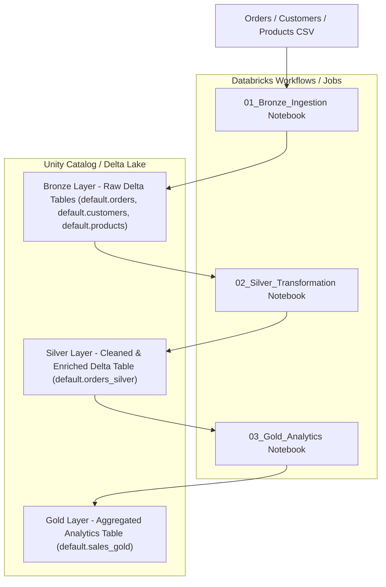

# E-commerce Databricks Project

**End-to-end e-commerce data pipeline using Databricks, Delta Lake, and PySpark**

## Project Overview

This project demonstrates a **full end-to-end data pipeline** for e-commerce analytics.  
It implements the **Medallion Architecture** (Bronze → Silver → Gold) using Databricks, enabling the ingestion, cleaning, transformation, and analysis of raw e-commerce data.

The pipeline processes:

- **Orders data**: transactional information for each purchase
- **Customer data**: details about the buyers
- **Product data**: catalog information

## Architecture

- **Bronze Layer**: Stores raw data exactly as ingested. Ensures traceability and allows reprocessing.  
- **Silver Layer**: Cleans and enriches the data: removes duplicates, fills nulls, standardizes timestamps, and joins with customers/products.  
- **Gold Layer**: Aggregated tables for business insights like total revenue per product, revenue per day, and top customers.

